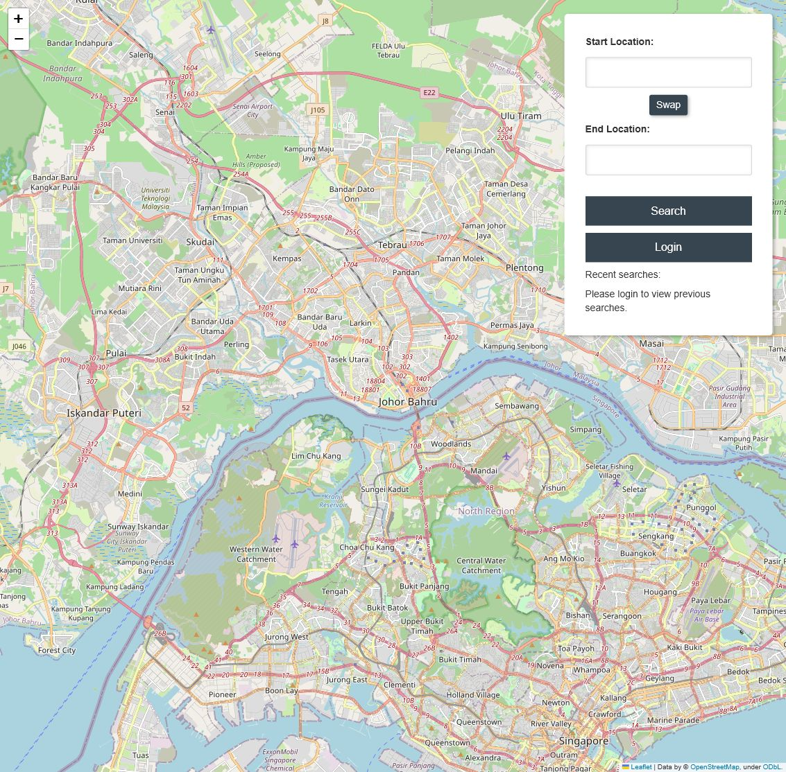
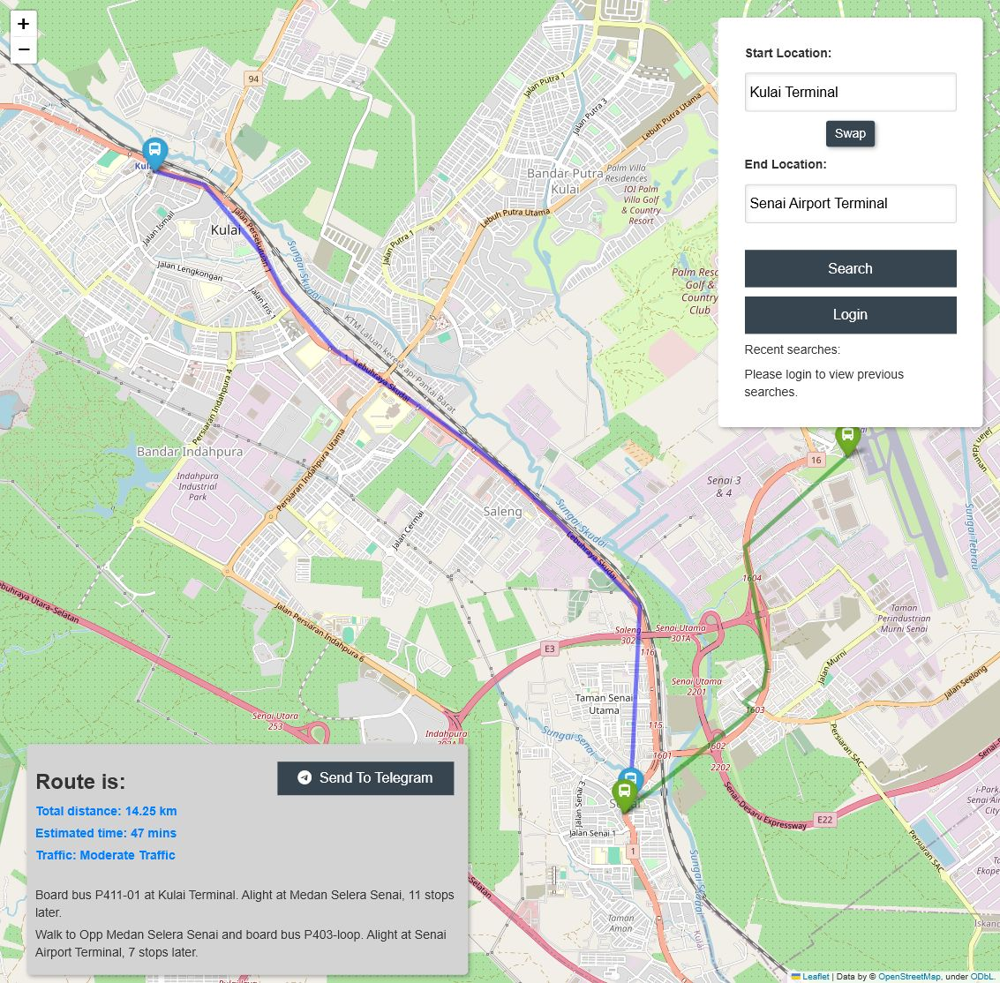
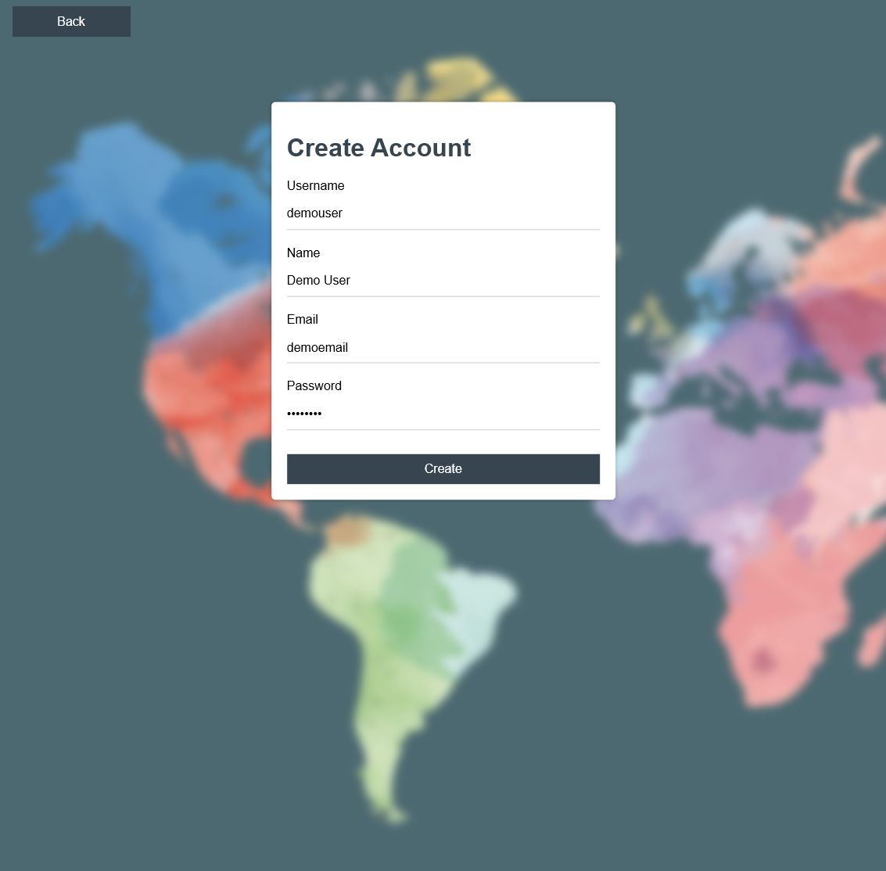
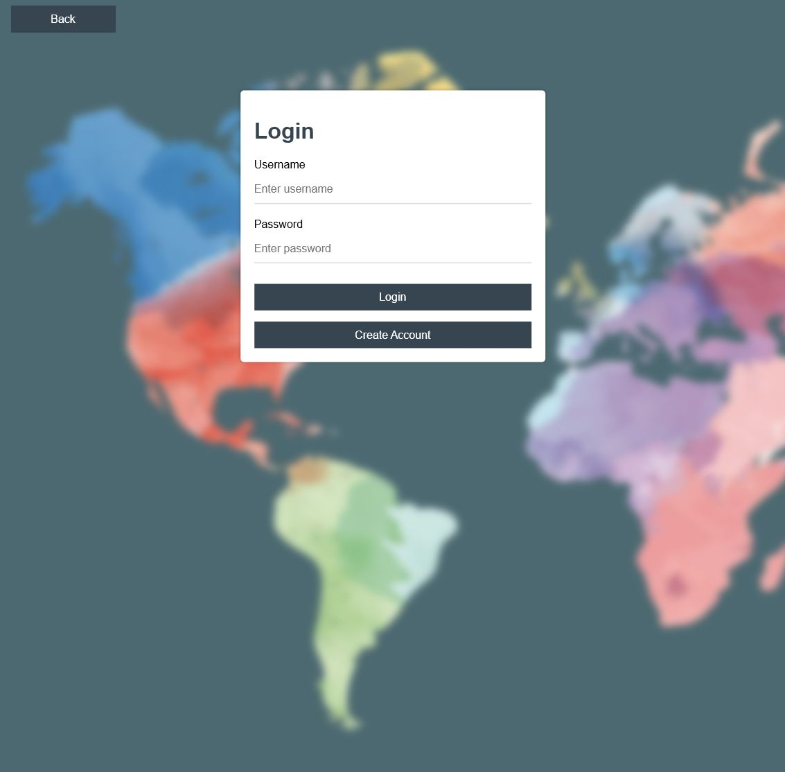
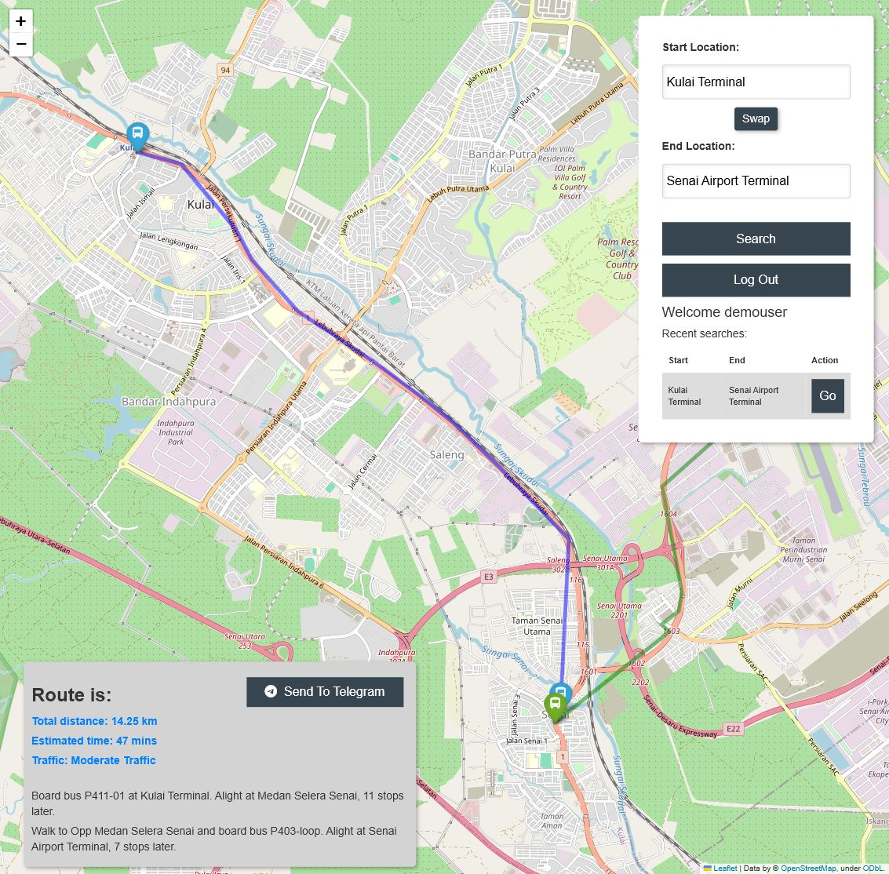
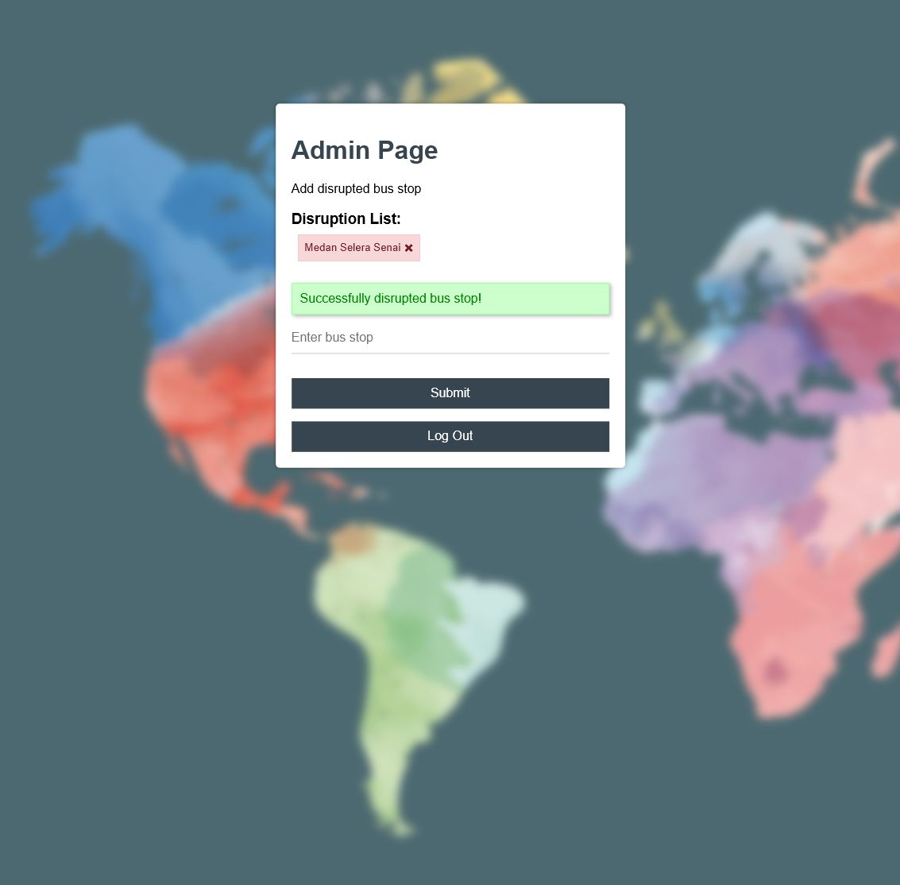
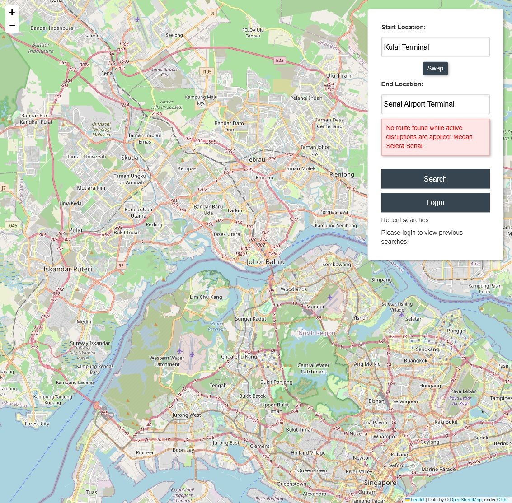
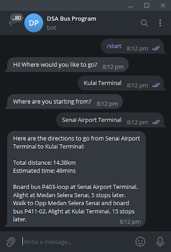
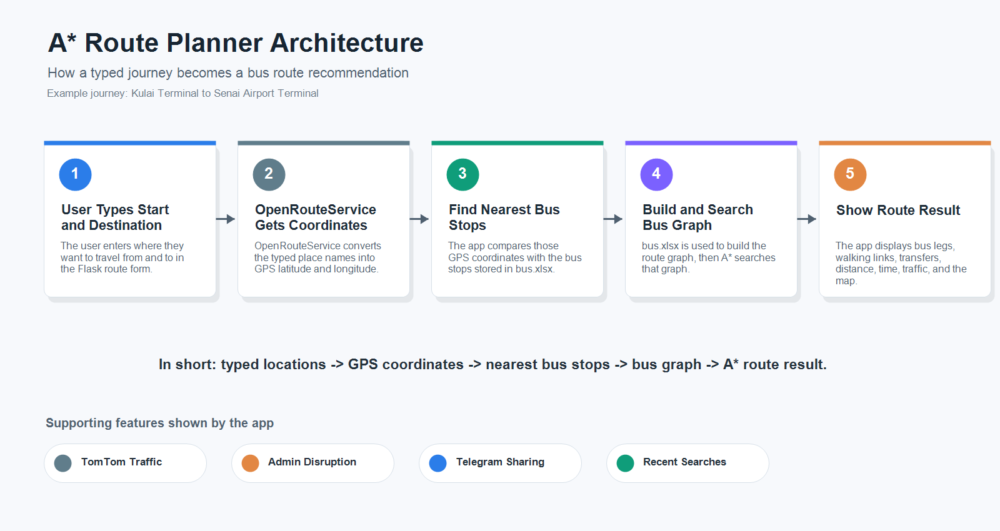

# A* Route Planner

A Flask-based journey planning application for selected Bas Muafakat Johor bus services, built as a CSC1108 Data Structures and Algorithms project at Singapore Institute of Technology.

## Overview

A* Route Planner is a CSC1108 Data Structures and Algorithms project at Singapore Institute of Technology that demonstrates how graph data structures and shortest-path search can support a real-world route planning use case.

The application plans journeys on selected Bas Muafakat Johor bus routes in Johor, Malaysia. Users can enter a starting location and destination, find nearby bus stops, receive a recommended route, and view the result on an interactive map.

The application combines nearest bus stop detection, A* shortest-route search, bus transfer handling, walking links for first-mile or last-mile connectivity, route visualisation, and optional Telegram route sharing.

## Features

- Nearest bus stop lookup from user-entered start and destination locations.
- Route recommendation using A* search over bus stop graph data.
- Support for bus transfers and walking segments between route legs.
- Folium map rendering with route lines and bus stop markers.
- User registration, login, logout, and recent search history.
- Optional TomTom traffic labels for route traffic conditions.
- Admin disruption management to mark bus stops as unavailable during route-planning tests.
- Optional Telegram bot sharing for sending generated route directions to a chat.

## Screenshots

### Home Map



### Route Search



### Register



### Login



### Recent Searches



### Admin Disruption Management



### Route With Disruption



### Telegram Bot



## Tech Stack

Application:

- Python
- Flask
- HTML
- CSS
- JavaScript

Data and mapping:

- Folium and Leaflet for map visualisation
- Pandas and OpenPyXL for bus stop spreadsheet data
- PostgreSQL or Supabase through psycopg2

External services:

- OpenRouteService API for geocoding and route geometry
- TomTom Traffic API for optional traffic data experiments
- Telegram Bot API for route delivery

## Architecture



The application starts with user-entered start and destination locations. OpenRouteService is used to resolve those inputs into coordinates, then the application finds the nearest known bus stops from the `bus.xlsx` dataset.

The bus stop data is loaded into graph-based structures, where stops are represented as nodes and route connections are represented as weighted edges. A* search finds a suitable path between the nearest start and destination bus stops. The route is then post-processed to assign bus services, identify transfers or walking links, and render the final result on a Folium map.

## Getting Started

Requirements:

- Python 3.11 or newer
- PostgreSQL-compatible database
- OpenRouteService API key
- Telegram bot token, optional for Telegram sending
- TomTom API key, optional for traffic experiments

Create and activate a virtual environment:

```powershell
python -m venv env
.\env\Scripts\activate
```

Install dependencies:

```powershell
pip install -r requirements.txt
```

Copy the environment template and fill in your local values:

```powershell
Copy-Item .env.example .env
```

Set the required environment variables before running the app. PowerShell example:

```powershell
$env:SECRET_KEY="replace-with-a-random-secret-key"
$env:POSTGRES_USER="replace-with-database-user"
$env:POSTGRES_PASSWORD="replace-with-database-password"
$env:POSTGRES_HOST="replace-with-database-host"
$env:POSTGRES_DATABASE="replace-with-database-name"
$env:TELEGRAM_API_TOKEN="replace-with-telegram-bot-token"
$env:TELEGRAM_CHAT_ID="replace-with-telegram-chat-id"
$env:ORS_API_TOKEN="replace-with-openrouteservice-api-token"
$env:TOMTOM_API_TOKEN="replace-with-tomtom-api-token"
```

Generate an admin password hash if you want to enable the admin disruption page:

```powershell
python -c "from werkzeug.security import generate_password_hash; print(generate_password_hash('your-password'))"
```

Store the generated hash in `ADMIN_PASSWORD_HASH` and set `ADMIN_USERNAME`.

Run the app:

```powershell
python start.py
```

The Flask app runs locally and serves the route planner from `/`.

## Usage

1. Open the app in a browser.
2. Enter a starting location and destination in the route search form.
3. Submit the search to calculate the nearest bus stops and recommended bus route.
4. Review the route directions, estimated distance, estimated time, optional traffic label, and map visualisation.
5. Register or log in to save and view recent searches.
6. Use the admin disruption page, when configured, to mark bus stops as disrupted for route-planning experiments.
7. Use the Telegram action, when configured, to send generated route directions through a Telegram bot.

## API Highlights

- `GET /` - render the main route planner map.
- `POST /search-route` - calculate and display a route between two user-entered locations.
- `POST /register` - create a user account.
- `POST /login` - authenticate a user or configured admin.
- `GET /logout` - clear the current user session.
- `GET /send-to-telegram` - send the current route directions to Telegram.
- `POST /disruption-bus-stop` - add a bus stop disruption from the admin page.
- `DELETE /disruption-bus-stop/<param>` - remove a bus stop disruption.

## Results

The Singapore Institute of Technology project produced a working journey planning application for selected Bas Muafakat Johor bus services.

- Implemented route planning from user-entered locations.
- Applied graph data structures and A* search for path finding.
- Visualised bus and walking routes on an interactive map.
- Supported selected Johor bus services used in the CSC1108 project scope.
- Added supporting features such as user accounts, recent searches, bus stop disruptions, and Telegram route sharing.

## Testing

Run a Python syntax check:

```powershell
python -m py_compile a_star.py config.py graph.py node.py start.py telegram.py utilities.py
```

Suggested manual test scenarios:

1. Search for a route between two valid Johor locations and confirm the map and directions render.
2. Submit an empty start or destination field and confirm validation appears.
3. Register a new user, log in, search for a route, and confirm recent searches appear.
4. Configure admin credentials, add a disrupted bus stop, and confirm it appears in the admin list.
5. Configure Telegram credentials and send a generated route to the configured chat.

## Project Structure

```text
astar-route-planner/
  a_star.py             A* pathfinding implementation
  graph.py              Bus stop graph construction
  node.py               Bus stop node model
  start.py              Flask app, routes, sessions, and map rendering
  telegram.py           Telegram bot route interaction
  utilities.py          Distance calculation and spreadsheet loading
  config.py             Environment-based configuration
  bus.xlsx              Bus stop and route dataset
  requirements.txt      Python dependencies
  templates/            Flask HTML templates
  static/               CSS, JavaScript, and image assets
  .env.example          Placeholder environment variable template
```

## Security Notes

- Do not commit real API keys, database passwords, Telegram tokens, or `.env` files.
- `.env.example` contains placeholders only and is safe to commit.
- The application reads sensitive configuration from environment variables.
- Admin access is disabled unless `ADMIN_USERNAME` and `ADMIN_PASSWORD_HASH` are configured.
- Generated route messages may contain user-entered locations, so treat Telegram delivery as an optional sharing feature.
